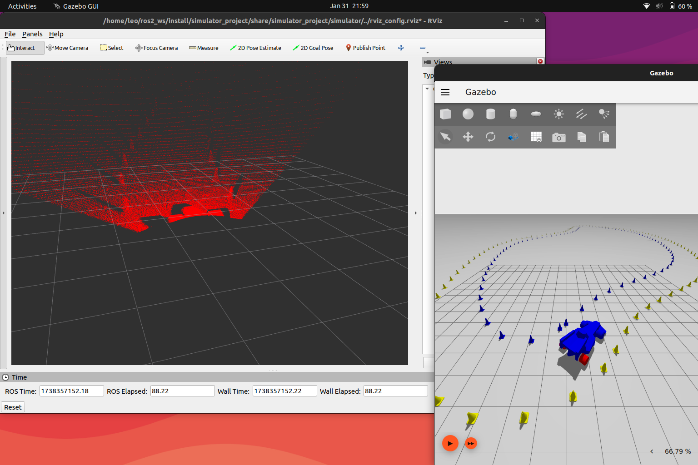
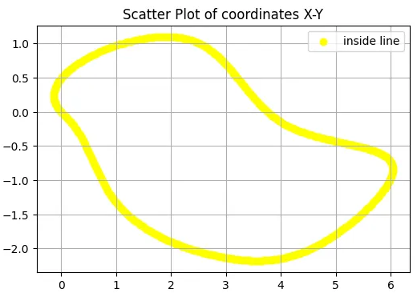
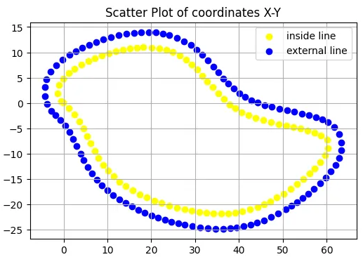

## Introduction

By launching this command, two windows ***should*** appear:

- 3D simulation of the track tested during the live test (using Gazebo)
- Pointcloud recorded by the car's lidar (using Rviz)



This is what you ***should*** expect to see

## Content

- `simulator/simulator_launch.py` : Python launch file. Aggregates all .sdf/.stl models and opens the various .yaml for gazebo simulation
- `params.yaml` : File with all customisable parameters see below...
- `models/<file_name>.stl` : Car and cones .stl models
- `sdf/`
    - `world_template.sdf` : Contains the template for the gazebo simulation world
    - `world.sdf` :  Contains the track for the gazebo simulation world with cones
- `tracks/race_track.csv` : Contains the shape of the track with coordinates
    
    
    
    
    Points from **race_track.csv**
    
    
    
    Points after run **simulator_launch.py**
    

## Prerequisite

To run this simulator you need: 

- Ubuntu 22.04
- **`ros2 humble`** [[link]](https://docs.ros.org/en/humble/Installation/Ubuntu-Install-Debs.html)
- **`gazebo fortress`** [[link]](https://gazebosim.org/docs/fortress/install/)

<aside>

    ⚠️ This simulator has been developed and tested with only these requisites in mind

</aside>

Then run the following code to install:

- **`ros-gz-bridge`**
- **`pandas`**
- **`numpy`**

```bash
sudo apt-get install ros-humble-ros-gz-bridge python3-numpy python3-pandas -y
```

## Build and run

Run the following code to build the simulator:

```bash
mkdir -p ~/ros2_ws/src
cd ~/ros2_ws/src
git clone https://github.com/leonardonels/simulator_project.git [CHANGE WITH MMR REPO]
cd ~/ros2_ws
colcon build --packages-select simulator_project --symlink-install
```

Then run the following code to run the simulator:

```bash
ros2 launch simulator_project simulator_launch.py
```

Finally, if you want to move the car with Gazebo:

- Click on the **plugin dropdown list** in the top right corner (*vertical ellipsis*)
- Select the **Key Publisher**

## Parameters

The following code explains what every parameter does:

```yaml
# Vehicle parameters
vehicle:
  abs_pose: [-2.4, 0, 0, 0, 0, -0.7]  # Absolute position and rotation
  linear_speed_f: 0.5 # Frontal car speed

# Lidar parameters
lidar:
  pose: [0.26, 0, 0.475, 0, -0.1570796, 0]  # Lidar position and rotation relative to the car
  hz: 20 # Lidar frequency
  h_samples: 500 # Number of Horizontal Rays
  h_min_angle: 2.356194   # 135° (convert from rads to degrees)
  h_max_angle: 3.926991   # 225° (convert from rads to degrees)
  h_resolution: 0.1 # Param that multiply h_samples
  v_samples: 128 # Number of Vertical Rays
  v_min_angle: -0.3926991 # -22.5° (convert from rads to degrees)
  v_max_angle: 0.3926991  # 22.5° (convert from rads to degrees)
  v_resolution: 0.1 # Param that multiply v_samples
  min_range: 0.01 # Lidar min depth range (THIS IS METERS!)
  max_range: 80.0 # Lidar max depth range (THIS IS METERS!)
  range_resolution: 0.01 # Param that multiply min_range and max_range
  noise_mean: 0.0 # Mean of the gaussian noise applied to Lidar
  noise_std: 0.05 # Std. Dev. of the gaussian noise applied to Lidar

# Cones parameters
cones:
  min_dist: 1.5 # Minimum distance between cones (THIS IS NOT METERS!)
  scale: 10 # Map coordinates scale
  track_width: 3 # Width of the track (THIS IS NOT METERS!)
```

## Future improvements

The following points could be improved/added in the future:

- [ ]  Modify the lidar sensor to have a variable density of points
- [ ]  Fine-Tuning lidar settings
- [ ]  Implement a more accurate steering mode
- [ ]  Add ros2 movement control
- [ ]  Apply the true model for the car
- [ ]  Improve performance

<aside>
    
    🏎️ Made by [**Leonardo Nels**](https://github.com/leonardonels) and [**Francesco Scalise**](https://github.com/frascalise) - 2025

</aside>
